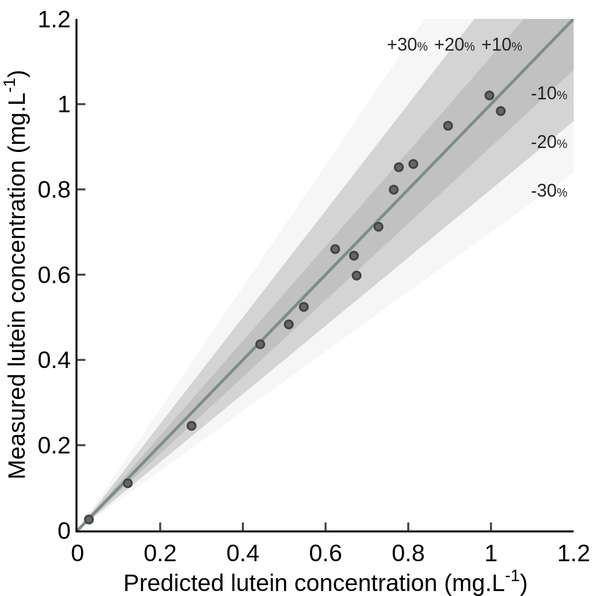

# Data and Particle Swarm Algorithm Optimizer associated with Partial Least Square for pigment spectrophotometric quantification

Repository hosting the Python codes (please be kind with the typos in the comments) and data associated with the article:
[Lutein, violaxanthin, and zeaxanthin spectrophotometric quantification: a machine learning approach.](https://www.springer.com/journal/10811)
Pozzobon, V., & Camarena-Bernard, C. (2022).
*Journal of Applied Phycology*, pp-pp.

It was tested successfully on October 2022.

## Data structure

The whole curated dataset is contained within _Pigment_Spectra_full.npy_ (and _Pigment_Spectra_full.txt_) (80 measurements). It was randomly split into _Pigment_Spectra_train.npy_ (and _Pigment_Spectra_train.txt_) containing 80 % of the data and _Pigment_Spectra_valid.npy_ hosting the remaining part. Individual measurements are stored as columns. The 461 first items are the spectrophotometric readings (from 340 to 800 nm), followed by the spectra derivatives (features 462 to 814), and the 5 remaining rows are chlorophyll _a_ (item 815), chlorophyll _b_ (item 816), zeaxanthin (item 817), lutein (item 818), violaxanthin (item 819) concentrations. Files are available in the _Data_ folder.

## How to run

__Step 1: algorithm testing__
The aim is to assess the performance of the PLS algorithm with an increasing number of wavelengths. To do so, a Particle Swarm Optimizer (PSO) selecting the wavelengths is nested in two loops. The first loop increases the number of available wavelengths (1 to 10). The second loop repeats the process many times (100) to create a random variable population.

To do so, simply run _PSO_IncreasingNbWL.py_, it will store the results of each run in a folder named _Screening_.

__Step 2: identifying the optimum__
Once the data are generated, simply load the results in your favorite software and draw the results. You can either identify the best performing configuration (_.i.e._ number of wavelengths) graphical or use a statistical test. In our case, we used the classical Python library (_Matplotlib_) for graphing and _statsmodels_ for the analysis.

__Step 3 (optional): confirming the optimum__
You can rerun _PSO_IncreasingNbWL.py_ with _screeningMode_ set to _False_ to run the PSO algorithm for only one number of wavelengths and confirm that the best performing run obtained previously was actually the optimum. Alternatively, you can directly extract the results from the _Screening_ folder.

__Step 4: validation__
Load the training and the validation datasets. Calibrate the PLS algorithm with the identified wavelengths on the training dataset and qualify its performances on the validation dataset. You can, for example, print predicted results vs. HPLC measurements (as displayed below for lutein).

    

## Contact

Please feel free to contact me. You can find my details on: https://victorpozzobon.github.io/
